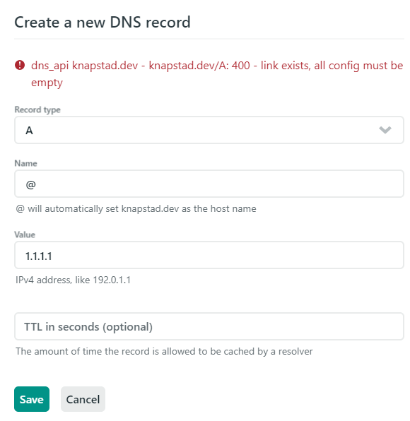

# How to add A and AAAA records on Netlify

If you have tried adding A and AAAA records on [Netlify](https://netlify.com) you might have stumbled on to some problems.
I had to add some A and AAAA records to my netlify site to levrage the serverside taging in google analytics.
And i encountered this error message:

 ```dns_api knapstad.dev - collect.knapstad.dev/A: 400 - link exists, all config must be empty```.



Turnes out Netlify has added some special DNS records of their own called NETLIFY and NETLIFYv6, these records will return the IP addresses for the closest CDN nodes based on the IP address of the system making the DNS lookup. And you can't add new records untill you have deleted those.
And they are locked by default.

The solution is to contact support if you have a payed account, but if you are on the free teir as I am you need to make a post to the support forum.
[So just head over to the #admin part of the netlify comunity](https://community.netlify.com/c/admin/47) and open a new topic explaining that you want to unlock the speciall records.
