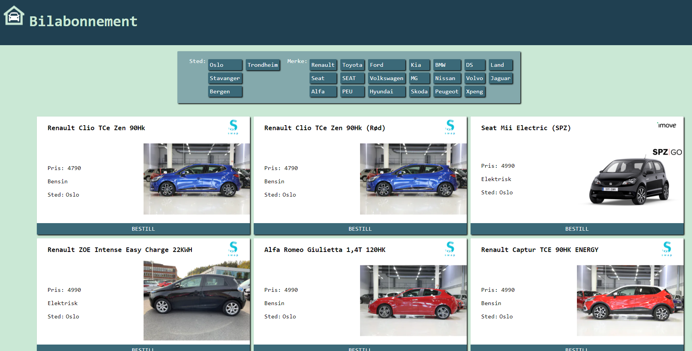

# [Bilabonnement.app Comparing car subscription prices](https://bilabonnement.app)

I made this site in part to learn more about [Vue](https://vuejs.org/) and [Sanity](https://sanity.io) and because the car subscription market in Norway is kindof hard to follow. Whats the cheepest car, what cars are available. [Bilabonnemnt.app makes that a lot easier](https://bilabonnement.app).

The site is built using vue as the front end. [Google Cloud Function](https://cloud.google.com/functions/) are used to serve up the different cars, and its also used to scrape the cars from the different suplyers. Sanity is used as a CMS for the articles on the site. And its all hosted on [Netlify](https://netlify.com)

[The site it self is in norwegian so you might not get that mutch out of visiting it](https://bilabonnement.app).

[But the code is available on github](https://github.com/Knapstad/bilabo)

